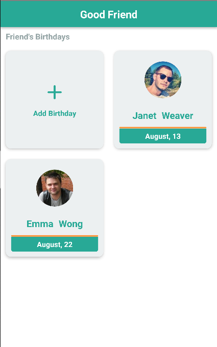

# Good Friend

This is a simple and funny app where you can save your friends birthdays so yo'll not for get it.
You'll be the best friend ever, a good friend ;)

## Test the App

### Android
The app is deployed in [Expo](https://expo.io), so make sure you have installed the expo client app
you can do it [here](https://play.google.com/store/apps/details?id=host.exp.exponent&hl=en)

Then you just have to open the next link on your browser and user the expo client app to scan the QR code to run the app in your phone. => [GoodFriend](https://exp.host/@rafaell416/GoodFriend)

### Ios
If you're using an Iphone, the same as android for you, make sure you have installed the expo client app, you can do it [here](https://itunes.apple.com/us/app/expo-client/id982107779?mt=8)

Then you just have to open the app and go to explore tab, there just search for GoodFriend and click on the app to open it.


### Screenshots



## For Devs

### Local Installation

Running the app locally is pretty simple, just follow up these commands
```
git clone git@github.com:Rafaell416/GoodFriend-App.git

cd GoodFriend-App

yarn install

yarn start
```
### Stack

This app was made with the next Stack of Technologies

- [React Native](https://facebook.github.io/react-native/)
- [Expo](https://expo.io)
- [ReqRes - Api](https://reqres.in/)
